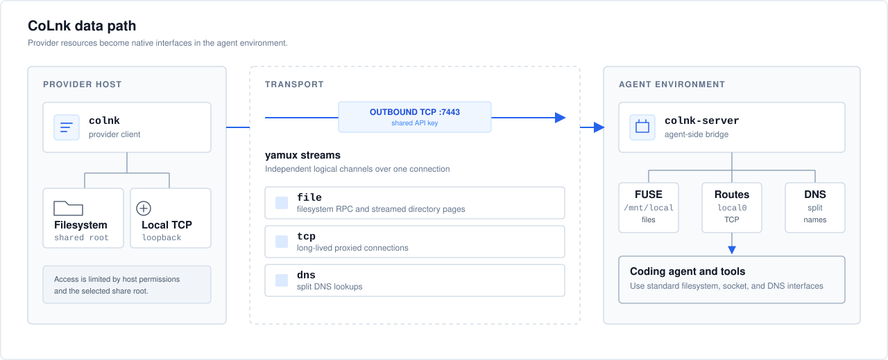

# CoLnk

**Use local filesystems and TCP services from a remote coding-agent environment.**

[](https://github.com/gesta-run/colnk/actions/workflows/ci.yml)
[](LICENSE)
[](go.mod)

CoLnk connects a remote agent environment to a provider host through interfaces that existing tools already understand:

- The provider filesystem appears as a standard FUSE mount.
- Approved provider-side TCP services are reachable through normal routes and split DNS.
- Coding agents, shells, editors, and build tools need no CoLnk-specific integration.

> [!WARNING]
> CoLnk is an MVP. The current transport uses a shared API key over unencrypted TCP. Run it only through Docker, a trusted private network, a controlled VPC, or another trusted transport. Do not expose it directly to the public Internet.

## How it works



`colnk` opens one outbound TCP connection from the provider host and carries filesystem, TCP, and DNS traffic over multiplexed streams. `colnk-server` exposes those resources to the agent environment through a FUSE mount, routes, and split DNS.

## Features

- Read-write FUSE access to `/` by default, or to a selected root with `--root`.
- Transparent IPv4 TCP access controlled by CIDR and port allowlists.
- `host.colnk` for reaching approved services bound to provider loopback.
- Automatic reconnect with bounded FUSE and network cleanup.
- Streamed directory listings, block caching, write aggregation, and payload compression.
- Provider-native credential storage, with macOS Keychain support today.
- Docker-based end-to-end development environment.

## Quick start with Docker

Requirements:

- macOS
- Go 1.24 or later
- Docker Desktop with FUSE support
- OpenSSL

Start the simulated Linux coding-agent environment:

```bash
make docker-up
```

In a second terminal, connect the current repository instead of the default `/` share:

```bash
./scripts/run-local-dev.sh --root "$PWD"
```

Open a shell as the simulated coding-agent user:

```bash
docker compose exec --user agent server sh
ls -la /mnt/local
getent hosts host.colnk
```

Stop the environment when finished:

```bash
make docker-down
```

## Install from source

### macOS client

```bash
./scripts/install-macos.sh
```

This installs `colnk` to `~/.local/bin` by default. Override the destination with `COLNK_INSTALL_DIR`.

### Linux server

Build the Linux AMD64 binary on any supported Go host:

```bash
make build-linux
```

The resulting binary is `bin/colnk-server-linux-amd64`. The target Linux environment requires:

- FUSE 3 and `/dev/fuse`
- `iproute2` and `iptables`
- root, or equivalent `SYS_ADMIN` and `NET_ADMIN` capabilities
- inbound reachability on the configured CoLnk TCP port

## Connect a provider to a Linux agent host

Generate one shared key and make it available to both programs. Prefer a protected file on the server and provider-native secure storage or an environment variable on the client.

Start the server in the coding agent's namespace:

```bash
sudo ./colnk-server \
  --listen :7443 \
  --api-key-file /etc/colnk/api-key \
  --mountpoint /mnt/local \
  --allow-other
```

Connect from the current macOS provider:

```bash
COLNK_API_KEY=sk-xxx colnk start \
  --endpoint agent.example.com:7443 \
  --root "$HOME/code"
```

Use `--save-key` once to store the selected key in macOS Keychain. Credential precedence is `--api-key`, `COLNK_API_KEY`, then Keychain on the client; the server also supports `--api-key-file`.

After the session is ready, Linux tools can use the shared filesystem directly:

```bash
cd /mnt/local
git status
```

## Local network access

The default policy exposes only the virtual host address `100.64.0.1/32`. `host.colnk` resolves to that address and maps TCP connections back to provider loopback.

The provider chooses which local networks and ports to expose when it connects. An empty `--allow-ports` value, which is the default, allows all TCP ports in the selected CIDRs:

```bash
COLNK_API_KEY=sk-xxx colnk start \
  --endpoint agent.example.com:7443 \
  --allow-cidrs 100.64.0.1/32,192.168.1.0/24,10.20.0.0/16 \
  --dns-suffixes corp.example,internal.example
```

Use `--allow-ports 22,80,443,5432` when the share should be restricted to specific TCP ports.

The Linux environment can then use ordinary clients:

```bash
curl http://host.colnk:3000
psql -h host.colnk -p 5432
```

CoLnk currently proxies IPv4 TCP only. It does not forward UDP, ICMP, Ethernet frames, or arbitrary VPN traffic.

## Security model

- The provider host and Linux agent environment are both trusted participants.
- The current macOS client must run as a non-root user.
- Filesystem access is limited by the provider process permissions and platform security controls.
- The default share is `/` with read-write access; use `--root` to reduce the exposed scope.
- Network access is limited by the provider-selected CIDRs, ports, and DNS suffixes; the server enforces the connection limit.
- File paths, DNS names, and TCP targets are omitted from logs unless `--audit-resources` is enabled.
- One server accepts one active provider session.
- The API key and payloads are not encrypted by CoLnk in the current MVP.

See [SECURITY.md](SECURITY.md) before deploying outside a local development environment.

## Configuration highlights

| Component | Option | Default | Purpose |
| --- | --- | --- | --- |
| Client | `--endpoint` | required | CoLnk server in `host:port` form |
| Client | `--root` | `/` | Provider directory exposed through FUSE |
| Client | `--save-key` | `false` | Store the API key in macOS Keychain |
| Server | `--mountpoint` | `/mnt/local` | FUSE mount visible to the coding agent |
| Client | `--allow-cidrs` | `100.64.0.1/32` | Reachable provider-side IPv4 ranges |
| Client | `--allow-ports` | all allowed CIDR ports | Reachable TCP ports |
| Client | `--dns-suffixes` | `colnk` | Names resolved through split DNS |
| Server | `--max-tcp-connections` | `256` | Concurrent proxied TCP limit |
| Server | `--metadata-cache-ttl` | `10s` | FUSE metadata cache lifetime |

Run `colnk --help` and `colnk-server --help` for the complete option list.

## Build and test

```bash
make build
make test
make test-linux
./scripts/test-docker.sh
```

The Docker test covers authentication, FUSE operations, transparent TCP, split DNS, namespace isolation, reconnects, and credential-safe logging.

## Current limitations

- macOS client and Linux server only.
- The server and coding agent must share the same filesystem and network namespace.
- A single TCP connection carries all yamux streams and can experience head-of-line blocking.
- Hard links, xattrs, mmap, offline writes, and complete POSIX open-handle semantics are not implemented.
- No multitenancy, multiple active providers, session routing, online revocation, or encrypted transport.

## Documentation

- [Architecture](docs/design.md)
- [Test cases](docs/test-cases.md)
- [Contributing](CONTRIBUTING.md)
- [Security policy](SECURITY.md)

## License

Licensed under the [Apache License 2.0](LICENSE).
